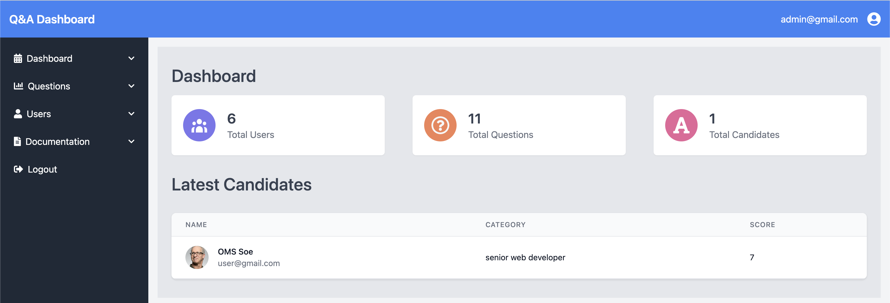
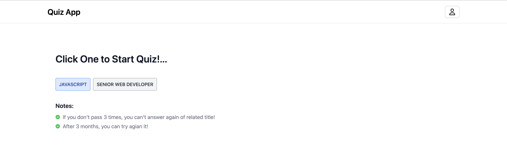
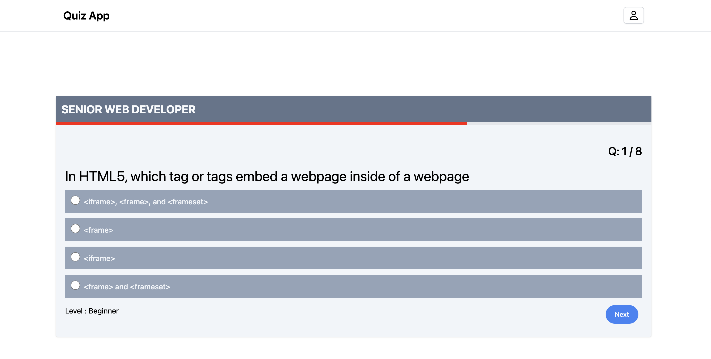

# Quiz App Project Description

This project is to build a quiz app using the MERN stack, which consists of MongoDB, Express.js, React.js, and Node.js. The app will allow users to create accounts, take quizzes on a variety of topics, and track their progress. Inspired from linkedinskillasseessment.

# Backend

The backend of the app will be built using Node.js and Express.js. It will expose a REST API that the frontend can use to interact with the database. The backend will also be responsible for handling user authentication and authorization.

# Database

The app will use MongoDB as its database. MongoDB is a NoSQL database that is well suited for storing and retrieving JSON data.

# Frontend

The frontend of the app will be built using React.js. React.js is a JavaScript library for building user interfaces. It is known for its speed, flexibility, and ease of use.
The frontend will include the following react hooks:

- React Context API
- React Reducer
- React Custom Hook

# Functionality & Features

# Client View

The quiz app will include the following features:

- User Account: Users can create accounts to track their progress and compete with others.
- Socail Login: User can easily create accounts with Socail Login (Google, Github)
- User Account Setting: Users can create new password and chnage informaition.
- Quiz selection: Users can browse and select quizzes from a variety of topics.
- Quiz timer: Some quizzes may include a timer to challenge users to complete the quiz in a certain amount of time.
- Scoring and feedback: The app will provide users with their score and feedback on their answers.

# Admin View Panel

- Leaderboards: The app may include leaderboards so that users can compete with each other for the highest score.
- Quiz lists: Administartor can browse all of quizzes and then administrator can CREATE, READ, UPDATE and DELETE of quiz
- Filter: Can filter quiz with cateogory and level

# How to Run Local Environment

### Run Backend Server

```
$ cd backend
$ yarn start
```



### Run Frontend

```
$ cd quiz-app
$ yarn start
```




